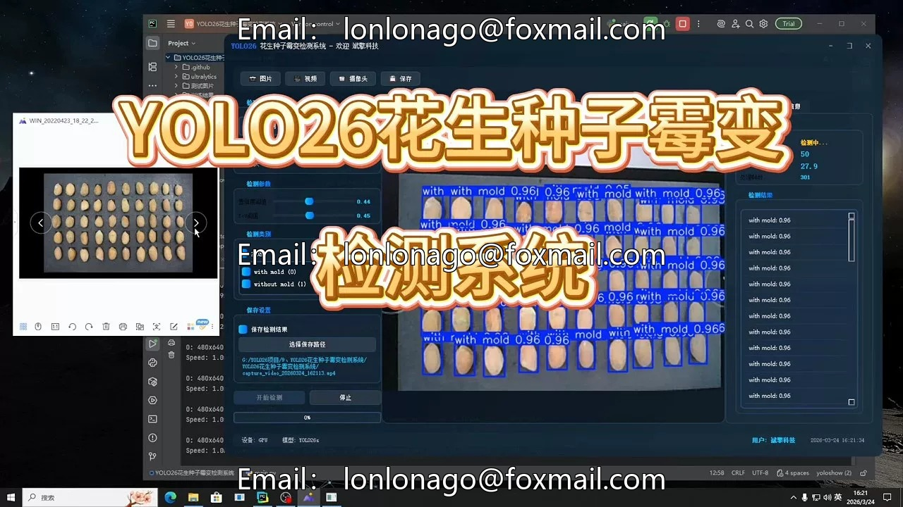
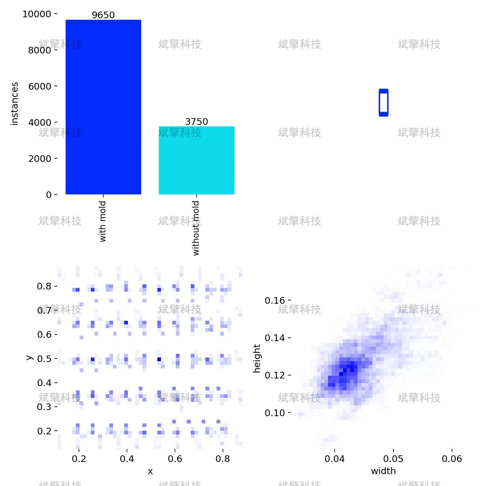
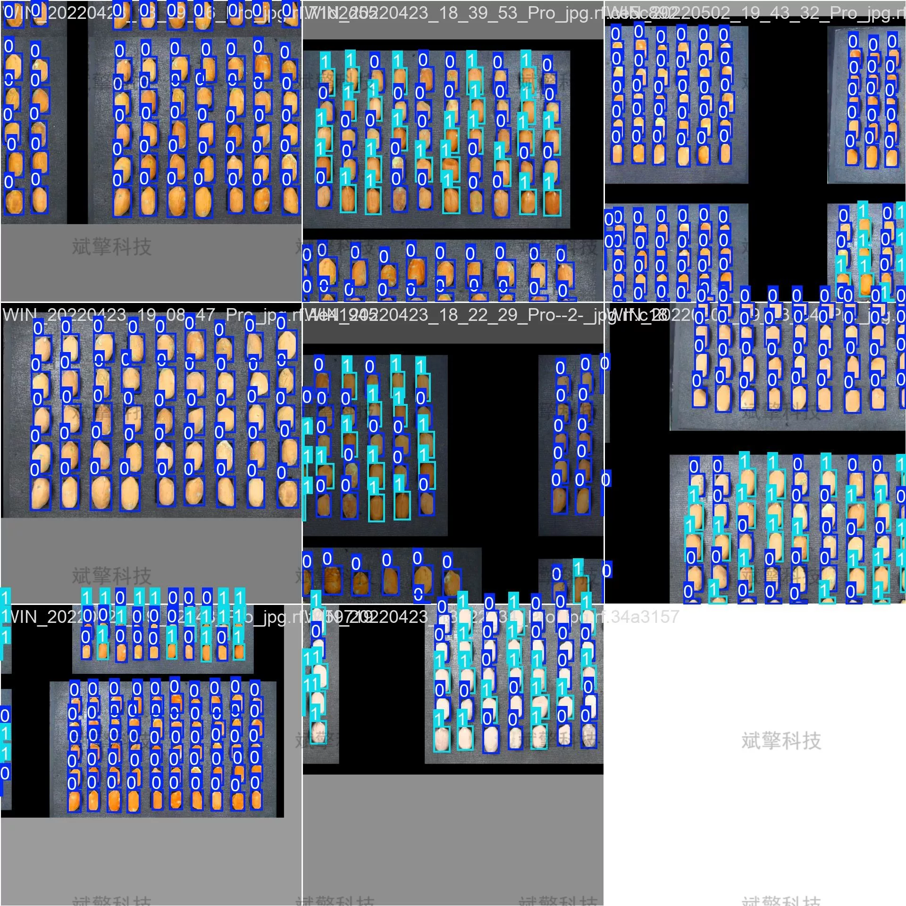
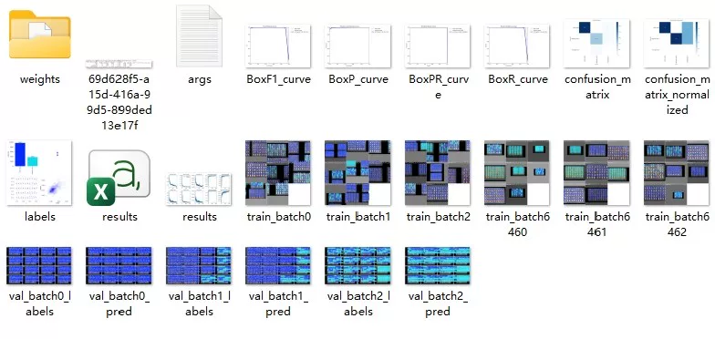
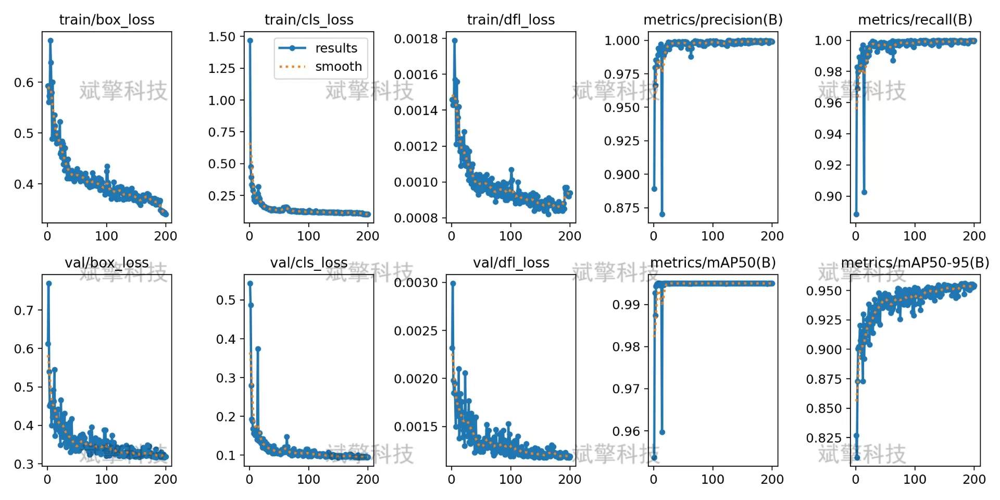
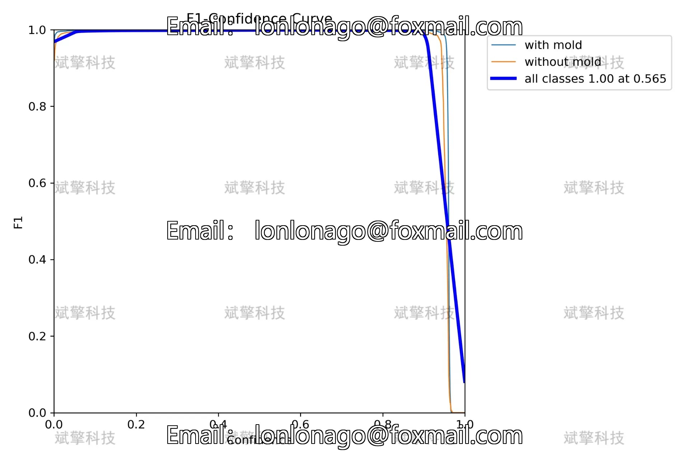
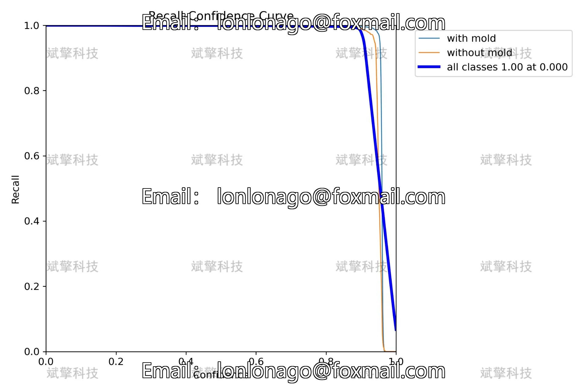
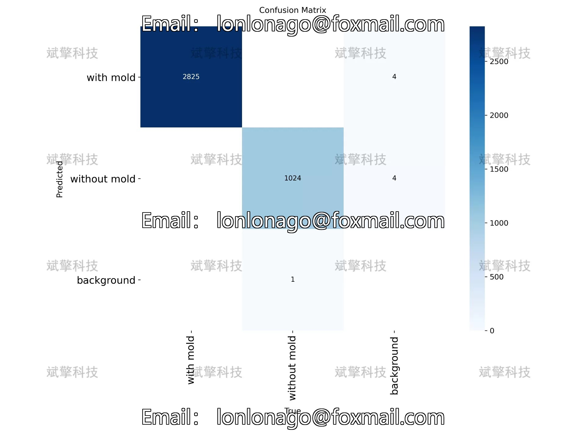

# YOLO26 peanut seed mold detection system | model

## Body

YOLO26 peanut seed mold detection system | Model lightweight YOLO26 model for peanut seed mold detection system: full process of dataset construction, model training and deployment

Peanuts, as an important economic crop and food raw material worldwide, their quality safety directly affects consumer health and industrial economic benefits. Mold is one of the main factors affecting peanut quality. Traditional manual detection methods have low efficiency, strong subjectivity, and are difficult to scale. This study builds a highly efficient and accurate peanut seed mold detection system based on the YOLO26 object detection algorithm. The system is designed to identify "with mold" (with mold) and "without mold" (without mold) samples.
The experimental dataset consists of 367 labeled images, divided into a training set (248), a validation set (77), and a test set (42). After training and evaluation, the model achieved an average precision (mAP50) of 0.995 and a recall rate close to 1.000 on the validation set. The experimental results show that the system has high accuracy and recall capabilities, capable of effectively supporting the automation of peanut seed mold detection tasks, with high practical application value.

Training set (Training Set): 248 images, used for learning and updating of model parameters.
Validation set (Validation Set): 77 images, used for hyperparameter tuning and performance evaluation (this analysis is based on this dataset).
Test set (Test Set): 42 images, used for final model generalization ability assessment.

Category setting
According to the actual state of peanut seeds, the dataset is labeled with two categories:
with mold, peanut seeds have mold areas (such as fungus spots, discoloration, etc.)
without mold, peanut seeds are in a normal state without obvious mold

Free reservation for remote installation. Unsuccessful full refund.
Purchase enjoy the following resources (Baidu Drive automatically unlocked)
   - YOLO recognition detection project complete source code
   - YOLO format datasets
   - Training code + UI interface code
   - Trained model + result images
   - Software installation package
   - Add WeChat reservation for remote installation (Automatically display WeChat ID after purchase) - Unsuccessful, full refund

⚙️ Core function modules
Detection capability
    Image detection: upload and check immediately, return detection box + category information
    Video detection: supports video files, analyzes frames accurately
    Camera real-time detection: connects USB camera, realizes dynamic monitoring
Interaction and control
    Target selection: freely choose one or more categories for detection
    Parameter real-time adjustment: adjustable confidence threshold & IoU threshold, flexible control of accuracy
    Result saving: save image/video/camera detection results in one click
System and data
    User login registration: Support password strength detection + encryption storage
    Log recording: automatically records operation and error information (timestamped)

## Images

## Payment

Here is a pay link on Stripe ( https://buy.stripe.com/3cs8yP7sY87d0vu9AB ). Please contact me lonlonago@foxmail.com after funding $89, and I will send you a complete data files , thank you!

